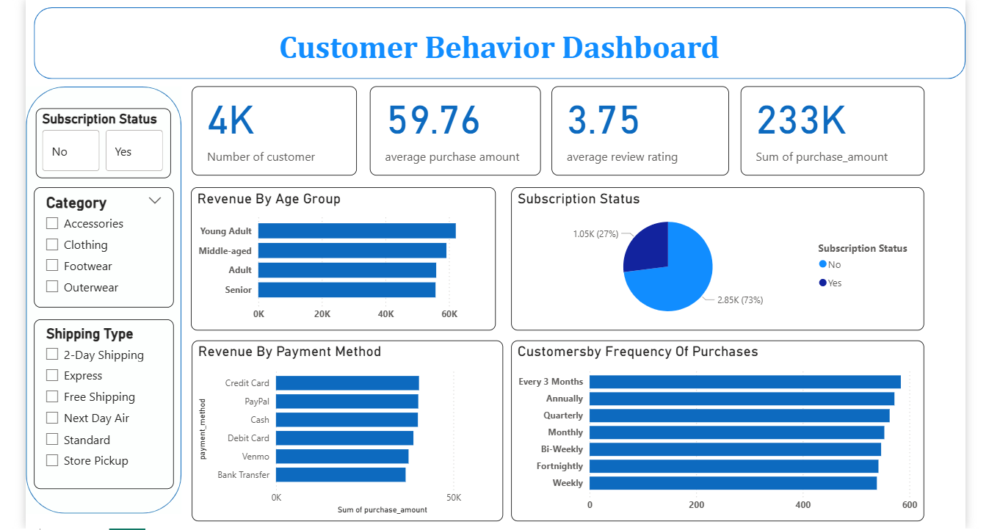

# Customer-Behavior-Analysis
📊Customer Behavior Analysis is an end-to-end data analysis project using Python, Power BI, and SQL. This project focuses on analyzing customer shopping behavior.

---

## 📌 Table of Contents
- <a href="#overview">Overview</a>
- <a href="#business-problem">Business Problem</a>
- <a href="#dataset">Dataset</a>
- <a href="#tools--technologies">Tools & Technologies</a>
- <a href="#Key-Matrics">Key Matrics</a>
- <a href="#dashboard">Dashboard</a>
- <a href="#Final-Recommendations">Final-Recommendations</a>
- <a href="#author--contact">Author & Contact</a>

---

<h2>Overview</h2>
This project is all about diving into retail data to figure out why customers buy what they do , specifically looking at how things like age,and payment choice impact sales. using of Python, Power BI and SQL the goal is to turn messy raw data into a clean ,interactive dashoard that shows clear trend.

---

<h2>Business Problem</h2>
A leading retail company wants to better understand its customers' shopping behavior in order to improve sales, customer satisfaction, and long-term loyalty. The management team has noticed changes in purchasing patterns across demographics, product categories, and sales channels (online vs. offline). They are particularly interested in uncovering which factors, such as discounts, reviews, seasons, or payment preferences, drive consumer decisions and repeat purchases.
You are tasked with analyzing the company's consumer behavior dataset to answer the following overarching business question:
"How can the company leverage consumer shopping data to identify trends, improve customer engagement, and optimize marketing and product strategies?"

---

<h2>Dataset</h2>

[Click here to get dataset](https://github.com/amlanmohanty1/customer-trends-data-analysis-SQL-Python-PowerBI/blob/main/customer_shopping_behavior.csv) 

---

<h2>Tools & Technologies</h2>

- Python – Used for initial data cleaning and transformation of the raw dataset.
- SQL – Used to structure the data and run complex queries to uncover customer trends.
- Power BI – Used to design interactive dashboards that visualize key business metrics.
- DAX & Data Modeling – Used within Power BI to create custom calculations and logically connect different data tables. 

---

<h2> 📊Key Metrics</h2>

* **Total Revenue:** $233K
* **Average Order Value:** $59.76
* **Total Customers:** 4,000
* **Avg. Review Rating:** 3.75 / 5.0
* **Retention (Subscribers):** 27%

---
<h2>Dashboard</h2>

- Power BI Dashboard shows
  - Summary
  - Total Customers 
  - Avg Purchase Amount 
  - Subscription Status  

---
<h2>Final Recommendations</h2>

* **Focus on the "Young Adult" Crowd:** Since this group is driving the most revenue, the marketing budget should lean heavily into the digital channels they use most.
* **Close the Subscription Gap:** Only 27% of customers are currently subscribers. Offering a "Member-Only" discount or free shipping for sign-ups would turn one-time buyers into steady, recurring revenue.
* **Time Your Outreach:** Most customers shop every 3 months or once a year. The company should send out personalized "We miss you" offers exactly when a customer is statistically due for their next purchase.
* **Boost that 3.75 Rating:** A 3.75 average rating suggests there is room to improve. By investigating reviews in specific categories like "Clothing" or "Accessories," we can address quality issues and push that score toward a 4.5.
* **Streamline the Checkout:** Credit cards and PayPal are the clear favorite payment methods. Ensuring these payment paths are as fast and "one-click" as possible will help lower cart abandonment.
<h2>Author & Contact</h2>

---
**Omkar Kotkar**  
Data Analyst  
📧 Email: kotkaromkar988@gmail.com   
🔗 [LinkedIn](https://www.linkedin.com/in/omkar-kotkar/)  
